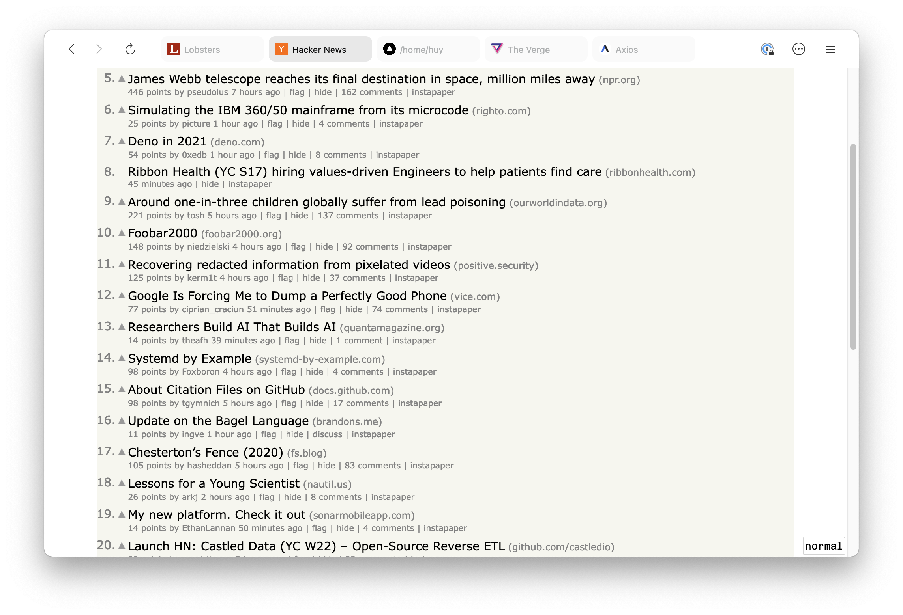
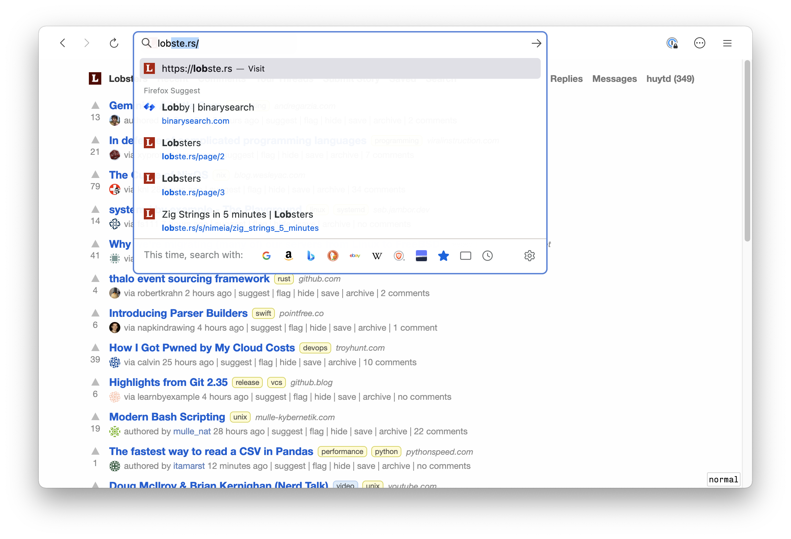

# Firefox Safari Custom Theme

My modification based on [WhiteSur Monterey](https://github.com/vinceliuice/WhiteSur-gtk-theme/tree/master/src/other/firefox/Monterey) theme.

What changed here are:

- Change the alignment of the tabbar
- Only show URL bar on focus (Cmd + L, or when create new tab)

How to install:

- Go to `about:profile` to open your Firefox's profile folder
- Copy `chrome` folder into that

